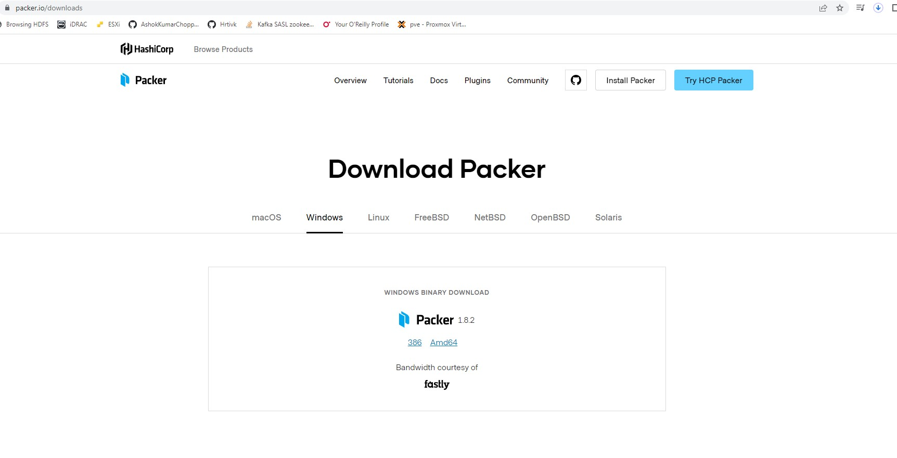
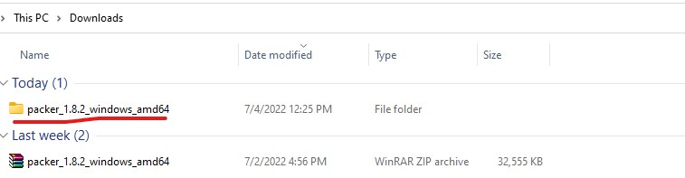
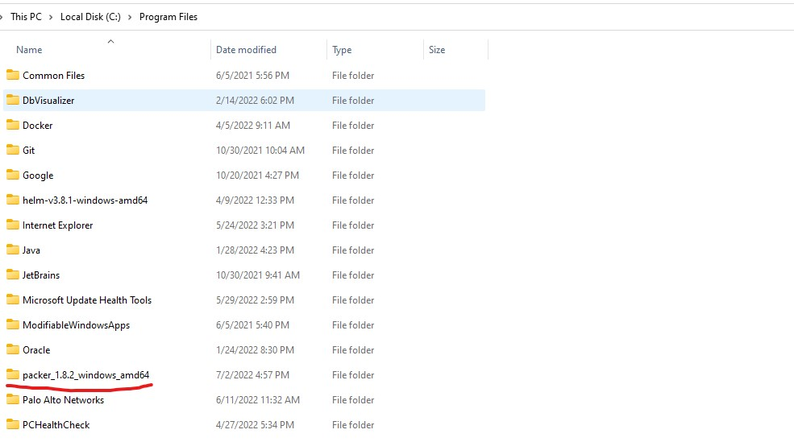
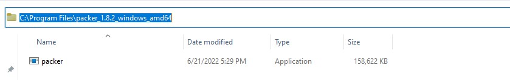
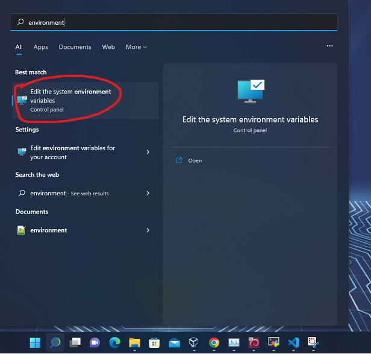
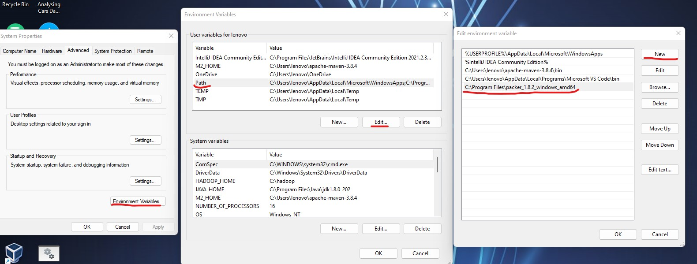
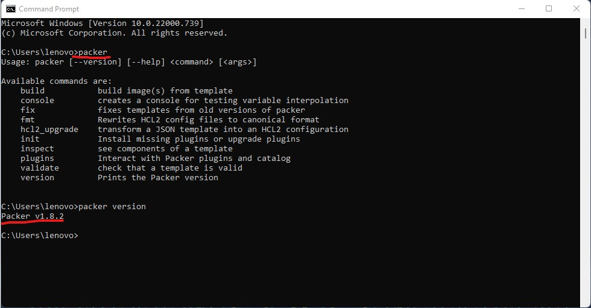
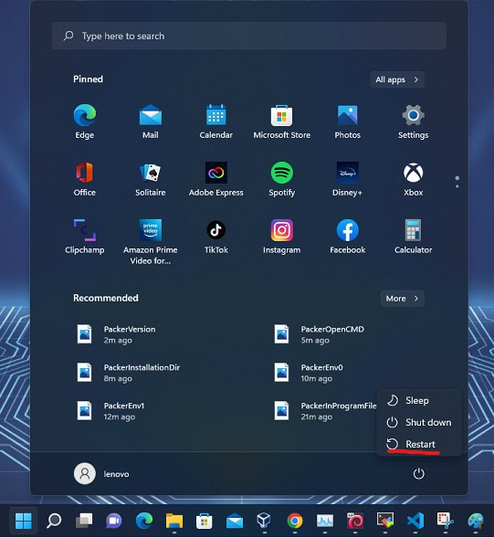

# Installing Hashicorp Packer on Windows 11

## Introduction

Packer is an open source tool that enables you to create identical machine images for multiple platforms from a single source template. A common use case is creating "golden images" that teams across an organization can use in cloud infrastructure.

## Installing Packer

### Download:

https://www.packer.io/downloads

 

### Unzip:

 

### Move to Program files:

 

### Adding packer binary to PATH environment variable:

* Copy the packer path

 

* Press START / Windows + environment



* Add the packer directory path to PATH environment variable



### Validate Packer Installation

* Open Command Prompt (Windows + CMD)

* Run `packer` or `packer version`

```
> packer

OR 

> packer version
```



### Restart the System


