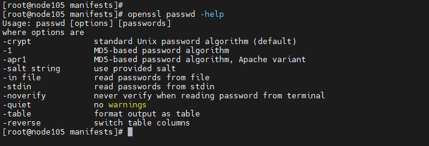
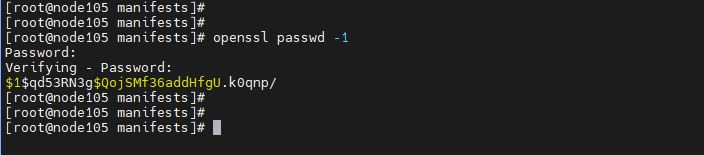

# Puppet Commands

## To validate a pp file:

Ex: system_user_class.pp

```
class system_user {
  user { 'bob':
    ensure     => 'present',
    comment    => 'User Bob',
    home       => '/home/bob',
    managehome => 'true',
    password   => '$1$X95v5HCs$7r.ro77pUryLdVjsqOYTq0'
  }
}
```

To validate the pp file:

```
puppet parser validate system_user_class.pp
```

# Generating Passwords

## For Users created by Puppet

On the Master Node, execute the following command to get the list of options available :

```
openssl passwd -help
```



To generate a password using MD5 algorithm:

```
openssl passwd -1
```

