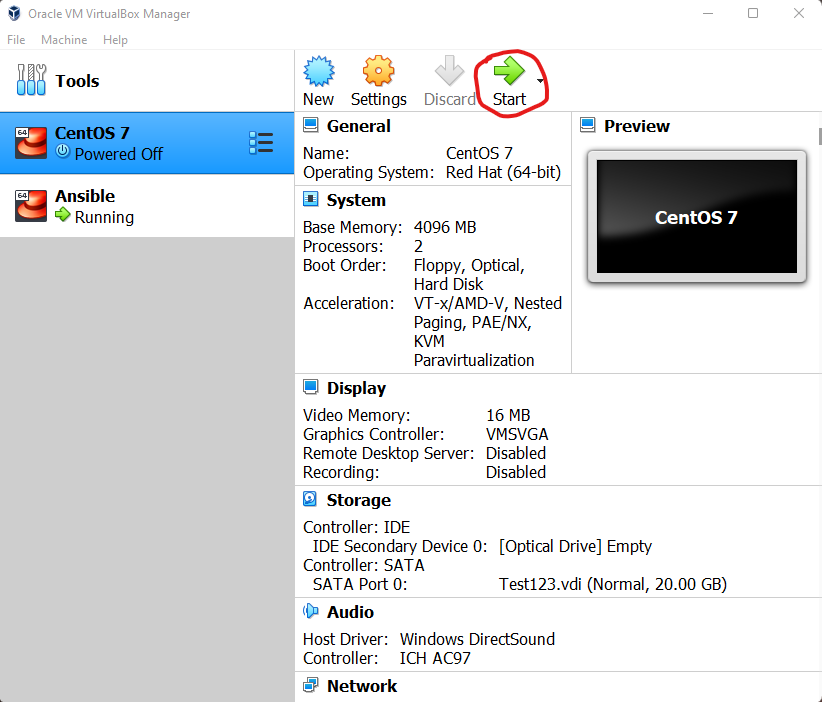
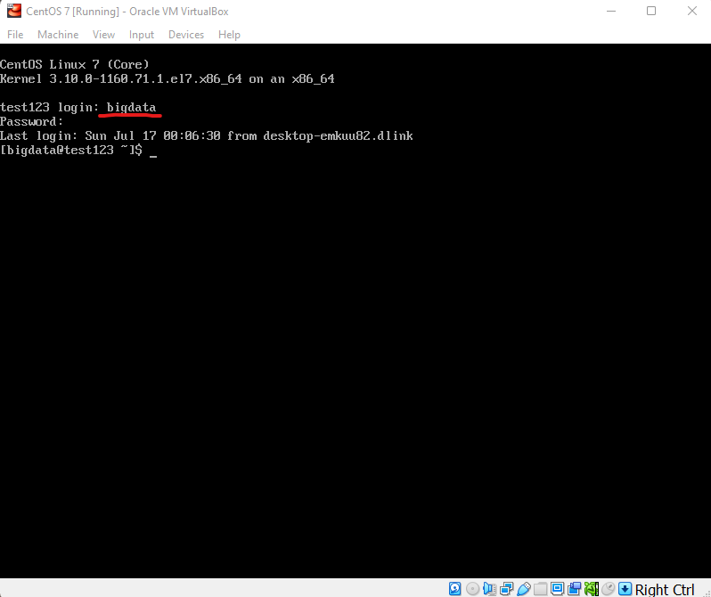
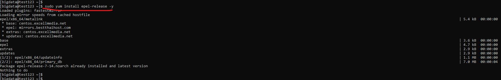
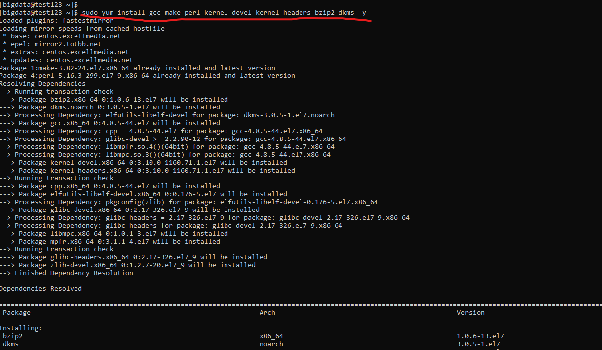
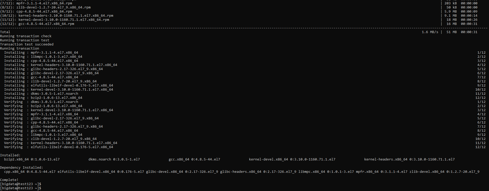
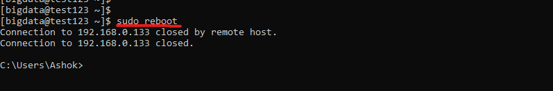

# VIRTUAL BOX - SHARED FOLDERS SETUP

### Pre-requisites
* Virtual Box
* Running VM (CentOS 7 Minimal)
* `sudo` or `root` permissions for user in VM

### Steps

1. Start Virtual Machine (VM)



2. Login



3. Install dependent packages

```
sudo yum install epel-release -y
```



```
sudo yum install gcc make perl kernel-devel kernel-headers bzip2 dkms -y
```





```
sudo reboot
```



4. Identify the 

scp "C:\Program Files\Oracle\VirtualBox\VBoxGuestAdditions.iso" bigdata@192.168.0.133:/home/bigdata


sudo mkdir -p /media/VirtualBoxGuestAdditionsISO
sudo mount -o loop /home/bigdata/VBoxGuestAdditions.iso /media/VirtualBoxGuestAdditionsISO
sudo cd /media/VirtualBoxGuestAdditionsISO
sudo ./VBoxLinuxAdditions.run
sudo reboot
sudo usermod --append --groups vboxsf ansible
sudo reboot


