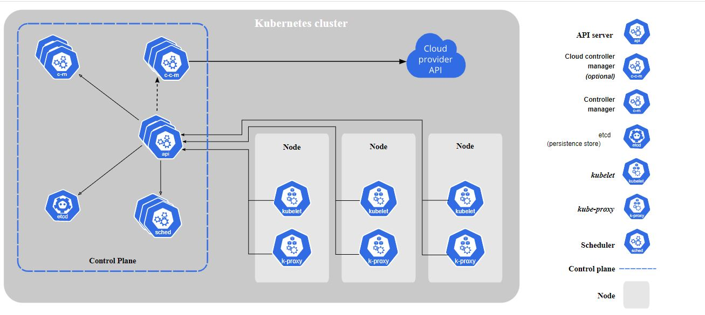

# Overview

## What is Kubernetes:

Kubernetes is a portable, extensible, open source platform for managing containerized workloads and services, that facilitates both declarative configuration and automation. It has a large, rapidly growing ecosystem. Kubernetes services, support, and tools are widely available.

## Why Kubernetes and what it can do

Kubernetes provides a framework to run distributed systems resiliently. It takes care of scaling and failover for the application, provides deployment patterns, and more.

Kubernetes provides:

- Service discovery and load balancing
- Storage orchestration
- Automated rollouts and rollbacks
- Automatic bin packing 
- Self-healing
- Secret and configuration management

## What Kubernetes is not

Kubernetes:

- Is not a traditional, all-inclusive PaaS (Platform as a Service) system.
- Does not limit the types of applications supported.
- Does not deploy source code and does not build your application.
- Does not provide application-level services like Spark, MySQL etc.,
- Does not dictate logging, monitoring, or alerting solutions.
- Does not provide nor mandate a configuration language/system.
- Does not provide nor adopt any comprehensive machine configuration, maintenance, management, or self-healing systems.
- Additionally, Kubernetes is not a mere orchestration system.

## Note:

    A Kubernetes cluster that handles production traffic should have a minimum of three nodes because if one node goes down, both an etcd member and a control plane instance are lost, and redundancy is compromised. You can mitigate this risk by adding more control plane nodes.

## Kubernetes Components

A Kubernetes cluster consists of a set of worker machines, called ***Nodes***, that run containerized applications.

The worker node(s) host the Pods that are the components of the application workload. The ***Control Plane*** manages the worker nodes and the Pods in the cluster
 
 

### Control Plane

- The Control Plane is responsible for managing the cluster. 
- The Control Plane coordinates all activities in your cluster, such as scheduling applications, maintaining applications' desired state, scaling applications, and rolling out new updates.

### Control Plane Components

- The Control Plane's components make global decisions about the cluster (for example, scheduling), as well as detecting and responding to cluster events (for example, starting up a new pod when a deployment's replicas field is unsatisfied).

#### kube-apiserver

`The API server is a component of the Kubernetes control plane that exposes the Kubernetes API. The API server is the front end for the Kubernetes control plane.`

#### etcd 

`Consistent and highly-available key value store used as Kubernetes' backing store for all cluster data.`

#### kube-scheduler

`kube-scheduler is a Control plane component that watches for newly created Pods with no assigned node, and selects a node for them to run on.`

#### kube-controller-manager

`kube-controller-manager is a Control plane component that runs controller processes.
Logically, each controller is a separate process, but to reduce complexity, they are all compiled into a single binary and run in a single process.
Some types of these controllers are:`
- Node controller
- Job controller
- Endpoints controller
- Service Account & Token controllers

#### cloud-controller-manager

 `cloud-controller-manager is a Kubernetes control plane component that embeds cloud-specific control logic.`

### Node

- A node is a VM or a physical computer that serves as a worker machine in a Kubernetes cluster.
- Each node has a Kubelet, which is an agent for managing the node and communicating with the Kubernetes control plane.
- The node should also have tools for handling container operations, such as containerd or Docker.

### Node Components

Node components run on every node, maintaining running pods and providing the Kubernetes runtime environment.

#### kubelet

An agent that runs on each node in the cluster. It makes sure that containers are running in a Pod.

The kubelet takes a set of PodSpecs that are provided through various mechanisms and ensures that the containers described in those PodSpecs are running and healthy. The kubelet doesn't manage containers which were not created by Kubernetes.

#### kube-proxy 

kube-proxy is a network proxy that runs on each node in your cluster, implementing part of the Kubernetes Service concept.

kube-proxy maintains network rules on nodes. These network rules allow network communication to your Pods from network sessions inside or outside of your cluster.

kube-proxy uses the operating system packet filtering layer if there is one and it's available. Otherwise, kube-proxy forwards the traffic itself.

#### Container runtime

The container runtime is the software that is responsible for running containers.

Kubernetes supports container runtimes such as docker, containerd, CRI-O, and any other implementation of the Kubernetes CRI (Container Runtime Interface).

### Addons

Addons use Kubernetes resources (DaemonSet, Deployment, etc) to implement cluster features. Because these are providing cluster-level features, namespaced resources for addons belong within the kube-system namespace.

#### DNS 

Cluster DNS is a DNS server, in addition to the other DNS server(s) in your environment, which serves DNS records for Kubernetes services.

Containers started by Kubernetes automatically include this DNS server in their DNS searches.

#### Web UI (Dashboard) 

Dashboard is a general purpose, web-based UI for Kubernetes clusters. It allows users to manage and troubleshoot applications running in the cluster, as well as the cluster itself.

#### Container Resource Monitoring

Container Resource Monitoring records generic time-series metrics about containers in a central database, and provides a UI for browsing that data.


#### Cluster-level Log

A cluster-level logging mechanism is responsible for saving container logs to a central log store with search/browsing interface.

## The Kubernetes API

The core of Kubernetes' control plane is the API server. The API server exposes an HTTP API that lets end users, different parts of your cluster, and external components communicate with one another.

The Kubernetes API lets you query and manipulate the state of API objects in Kubernetes (for example: Pods, Namespaces, ConfigMaps, and Events).

Most operations can be performed through the ***kubectl*** command-line interface or other command-line tools, such as ***kubeadm***, which in turn use the API. However, you can also access the API directly using REST calls.

### Persistence

Kubernetes stores the serialized state of objects by writing them into ***etcd**.

### API groups and versioning

To make it easier to eliminate fields or restructure resource representations, Kubernetes supports multiple API versions, each at a different API path, such as /api/v1 or /apis/rbac.authorization.k8s.io/v1alpha1.

Versioning is done at the API level rather than at the resource or field level to ensure that the API presents a clear, consistent view of system resources and behavior, and to enable controlling access to end-of-life and/or experimental APIs.

To make it easier to evolve and to extend its API, Kubernetes implements API groups that can be enabled or disabled.

API resources are distinguished by their API group, resource type, namespace (for namespaced resources), and name. The API server handles the conversion between API versions transparently: all the different versions are actually representations of the same persisted data. The API server may serve the same underlying data through multiple API versions.

#### API changes

Any system that is successful needs to grow and change as new use cases emerge or existing ones change. Therefore, Kubernetes has designed the Kubernetes API to continuously change and grow. The Kubernetes project aims to not break compatibility with existing clients, and to maintain that compatibility for a length of time so that other projects have an opportunity to adapt.

### API Extension

The Kubernetes API can be extended in one of two ways:

- Custom resources let you declaratively define how the API server should provide your chosen resource API.
- You can also extend the Kubernetes API by implementing an aggregation layer.

## Working with Kubernetes Objects

### Understanding Kubernetes Objects

*Kubernetes objects* are persistent entities in the Kubernetes system. Kubernetes uses these entities to represent the state of your cluster. Specifically, they can describe:

- What containerized applications are running (and on which nodes)
- The resources available to those applications
- The policies around how those applications behave, such as restart policies, upgrades, and fault-tolerance

A Kubernetes object is a "record of intent"--once you create the object, the Kubernetes system will constantly work to ensure that object exists. By creating an object, you're effectively telling the Kubernetes system what you want your cluster's workload to look like; this is your cluster's *desired* state.

To work with Kubernetes objects--whether to create, modify, or delete them--you'll need to use the Kubernetes API.

#### Object Spec and Status 

Almost every Kubernetes object includes two nested object fields that govern the object's configuration: the object *spec* and the object *status*. For objects that have a spec, you have to set this when you create the object, providing a description of the characteristics you want the resource to have: its *desired* state.

The *status* describes the current state of the object, supplied and updated by the Kubernetes system and its components. The Kubernetes control plane continually and actively manages every object's actual state to match the desired state you supplied.

#### Describing a Kubernetes object

When you create an object in Kubernetes, you must provide the object spec that describes its desired state, as well as some basic information about the object (such as a name). When you use the Kubernetes API to create the object (either directly or via kubectl), that API request must include that information as JSON in the request body. Most often, you provide the information to kubectl in a .yaml file. kubectl converts the information to JSON when making the API request.

Here's an example .yaml file that shows the required fields and object spec for a Kubernetes Deployment:

```
apiVersion: apps/v1
kind: Deployment
metadata:
  name: nginx-deployment
spec:
  selector:
    matchLabels:
      app: nginx
  replicas: 2 # tells deployment to run 2 pods matching the template
  template:
    metadata:
      labels:
        app: nginx
    spec:
      containers:
      - name: nginx
        image: nginx:1.14.2
        ports:
        - containerPort: 80

```

One way to create a Deployment using a .yaml file like the one above is to use the kubectl apply command in the kubectl command-line interface, passing the .yaml file as an argument. Here's an example:

```
kubectl apply -f https://k8s.io/examples/application/deployment.yaml
```

The output is similar to this:

```
deployment.apps/nginx-deployment created
```

#### Required Fields 

In the .yaml file for the Kubernetes object you want to create, you'll need to set values for the following fields:

- *apiVersion* - Which version of the Kubernetes API you're using to create this object
- *kind* - What kind of object you want to create
- *metadata* - Data that helps uniquely identify the object, including a name string, UID, and optional namespace
- *spec* - What state you desire for the object


## Kubernetes Object Management

The kubectl command-line tool supports several different ways to create and manage Kubernetes objects.

### Management Techniques

Management technique | Operates on | Recommended environment | Supported  writers | Learning curve
-------------------- | ----------- | ----------------------- | ------------------ | --------------
Imperative commands	 | Live objects |	Development projects	 |         1+	        |    Lowest
Imperative object configuration	| Individual files | Production projects | 1 | Moderate
Declarative object configuration | Directories of files	| Production projects	| 1+ |Highest

#### Imperative commands

When using imperative commands, a user operates directly on live objects in a cluster. The user provides operations to the kubectl command as arguments or flags.

Example:

```
kubectl create deployment nginx --image nginx
```

##### Trade-offs

Advantages compared to object configuration:

- Commands are expressed as a single action word.
- Commands require only a single step to make changes to the cluster.

Disadvantages compared to object configuration:

- Commands do not integrate with change review processes.
- Commands do not provide an audit trail associated with changes.
- Commands do not provide a source of records except for what is live.
- Commands do not provide a template for creating new objects.

#### Imperative object configuration

In imperative object configuration, the kubectl command specifies the operation (create, replace, etc.), optional flags and at least one file name. The file specified must contain a full definition of the object in YAML or JSON format.

Examples:

***CREATE***

```
kubectl create -f nginx.yaml
```

***DELETE***

```
kubectl delete -f nginx.yaml -f redis.yaml
```

***UPDATE***

```
kubectl replace -f nginx.yaml
```

##### Trade-offs

Advantages compared to imperative commands:

- Object configuration can be stored in a source control system such as Git.
- Object configuration can integrate with processes such as reviewing changes before push and audit trails.
- Object configuration provides a template for creating new objects.

Disadvantages compared to imperative commands:

- Object configuration requires basic understanding of the object schema.
- Object configuration requires the additional step of writing a YAML file.

Advantages compared to declarative object configuration:

- Imperative object configuration behavior is simpler and easier to understand.
- As of Kubernetes version 1.5, imperative object configuration is more mature.

Disadvantages compared to declarative object configuration:

- Imperative object configuration works best on files, not directories.
- Updates to live objects must be reflected in configuration files, or they will be lost during the next replacement.

#### Declarative object configuration

When using declarative object configuration, a user operates on object configuration files stored locally, however the user does not define the operations to be taken on the files. Create, update, and delete operations are automatically detected per-object by kubectl. This enables working on directories, where different operations might be needed for different objects.

Examples

Process all object configuration files in the configs directory, and create or patch the live objects. You can first diff to see what changes are going to be made, and then apply:

```
kubectl diff -f configs/

kubectl apply -f configs/
```

Recursively process directories:

```
kubectl diff -R -f configs/

kubectl apply -R -f configs/
```

##### Trade-offs
Advantages compared to imperative object configuration:

- Changes made directly to live objects are retained, even if they are not merged back into the configuration files.
- Declarative object configuration has better support for operating on directories and automatically detecting operation types (create, patch, delete) per-object.

Disadvantages compared to imperative object configuration:

- Declarative object configuration is harder to debug and understand results when they are unexpected.
- Partial updates using diffs create complex merge and patch operations.

## Object Names and IDs

Each object in your cluster has a Name that is unique for that type of resource. Every Kubernetes object also has a UID that is unique across your whole cluster.

### Names

A client-provided string that refers to an object in a resource URL, such as /api/v1/pods/some-name.

Only one object of a given kind can have a given name at a time. However, if you delete the object, you can make a new object with the same name.

### UIDs 

A Kubernetes systems-generated string to uniquely identify objects.

Every object created over the whole lifetime of a Kubernetes cluster has a distinct UID. It is intended to distinguish between historical occurrences of similar entities.

## Namespaces

In Kubernetes, namespaces provides a mechanism for isolating groups of resources within a single cluster. Names of resources need to be unique within a namespace, but not across namespaces. Namespace-based scoping is applicable only for namespaced objects (e.g. Deployments, Services, etc) and not for cluster-wide objects (e.g. StorageClass, Nodes, PersistentVolumes, etc).

Namespaces are a way to divide cluster resources between multiple users

### Working with Namespaces

`Note: Avoid creating namespaces with the prefix kube-, since it is reserved for Kubernetes system namespaces.`

#### Viewing namespaces

You can list the current namespaces in a cluster using:

```
kubectl get namespace
```

Kubernetes starts with four initial namespaces:

- ***default*** The default namespace for objects with no other namespace
- ***kube-system*** The namespace for objects created by the Kubernetes system
- ***kube-public*** This namespace is created automatically and is readable by all users (including those not authenticated). This namespace is mostly reserved for cluster usage.
- ***kube-node-lease*** This namespace holds Lease objects associated with each node. Node leases allow the kubelet to send heartbeats so that the control plane can detect node failure.

#### Setting the namespace for a request

To set the namespace for a current request, use the --namespace flag.

For example:

```
kubectl run nginx --image=nginx --namespace=<insert-namespace-name-here>

kubectl get pods --namespace=<insert-namespace-name-here>
```

#### Setting the namespace preference

You can permanently save the namespace for all subsequent kubectl commands in that context.

```
kubectl config set-context --current --namespace=<insert-namespace-name-here>

# Validate it

kubectl config view --minify | grep namespace:
```

### Namespaces and DNS

When you create a Service, it creates a corresponding DNS entry. This entry is of the form *`<service-name>`.`<namespace-name>`.svc.cluster.local*, which means that if a container only uses `<service-name>`, it will resolve to the service which is local to a namespace. This is useful for using the same configuration across multiple namespaces such as Development, Staging and Production.

### Not All Objects are in a Namespace

Most Kubernetes resources (e.g. pods, services, replication controllers, and others) are in some namespaces. However namespace resources are not themselves in a namespace. And low-level resources, such as nodes and persistentVolumes, are not in any namespace.

To see which Kubernetes resources are and aren't in a namespace:

```
# In a namespace
kubectl api-resources --namespaced=true

# Not in a namespace
kubectl api-resources --namespaced=false
```

### Automatic labelling 

The Kubernetes control plane sets an immutable label kubernetes.io/metadata.name on all namespaces, provided that the NamespaceDefaultLabelName feature gate is enabled.
The value of the label is the namespace name.

## Labels and Selectors

*Labels* are key/value pairs that are attached to objects, such as pods. Labels are intended to be used to specify identifying attributes of objects that are meaningful and relevant to users, but do not directly imply semantics to the core system. Labels can be used to organize and to select subsets of objects. Labels can be attached to objects at creation time and subsequently added and modified at any time. Each object can have a set of key/value labels defined. Each Key must be unique for a given object.

```
"metadata": {
  "labels": {
    "key1" : "value1",
    "key2" : "value2"
  }
}
```

### Motivation

Labels enable users to map their own organizational structures onto system objects in a loosely coupled fashion, without requiring clients to store these mappings.

Example labels:
```
"release" : "stable", "release" : "canary"
"environment" : "dev", "environment" : "qa", "environment" : "production"
"tier" : "frontend", "tier" : "backend", "tier" : "cache"
"partition" : "customerA", "partition" : "customerB"
"track" : "daily", "track" : "weekly"
```

### Syntax and character set 

Valid label value:

- must be 63 characters or less (can be empty),
- unless empty, must begin and end with an alphanumeric character ([a-z0-9A-Z]),
- could contain dashes (-), underscores (_), dots (.), and alphanumerics between.

For example, here's the configuration file for a Pod that has two labels `environment: production` and `app: nginx` :

```
apiVersion: v1
kind: Pod
metadata:
  name: label-demo
  labels:
    environment: production
    app: nginx
spec:
  containers:
  - name: nginx
    image: nginx:1.14.2
    ports:
    - containerPort: 80
```

### Label selectors

Unlike names and UIDs, labels do not provide uniqueness. In general, we expect many objects to carry the same label(s).

Via a label selector, the client/user can identify a set of objects. The label selector is the core grouping primitive in Kubernetes.

The API currently supports two types of selectors: *`equality-based`* and *`set-based`*. A label selector can be made of multiple requirements which are comma-separated. In the case of multiple requirements, all must be satisfied so the comma separator acts as a logical AND (&&) operator.

#### Equality-based requirement 

Equality- or inequality-based requirements allow filtering by label keys and values. Matching objects must satisfy all of the specified label constraints, though they may have additional labels as well. Three kinds of operators are admitted =,==,!=.

```
environment = production
tier != frontend
```

One usage scenario for equality-based label requirement is for Pods to specify node selection criteria. For example, the sample Pod below selects nodes with the label "accelerator=nvidia-tesla-p100".

```
apiVersion: v1
kind: Pod
metadata:
  name: cuda-test
spec:
  containers:
    - name: cuda-test
      image: "k8s.gcr.io/cuda-vector-add:v0.1"
      resources:
        limits:
          nvidia.com/gpu: 1
  nodeSelector:
    accelerator: nvidia-tesla-p100
```

#### Set-based requirement

Set-based label requirements allow filtering keys according to a set of values. Three kinds of operators are supported: in,notin and exists (only the key identifier). For example:

```
environment in (production, qa)
tier notin (frontend, backend)
partition
!partition
```

### API 

#### LIST and WATCH filtering

**LIST** and **WATCH** operations may specify label selectors to filter the sets of objects returned using a query parameter. Both requirements are permitted (presented here as they would appear in a URL query string):

- equality-based requirements: ?labelSelector=environment%3Dproduction,tier%3Dfrontend
- set-based requirements: ?labelSelector=environment+in+%28production%2Cqa%29%2Ctier+in+%28frontend%29

Both label selector styles can be used to list or watch resources via a REST client. For example, targeting *`apiserver`* with *`kubectl`* and using *`equality-based`* one may write:

```
kubectl get pods -l environment=production,tier=frontend
```

or using *`set-based`* requirements:

```
kubectl get pods -l 'environment in (production),tier in (frontend)'
```

As already mentioned *`set-based`* requirements are more expressive.  For instance, they can implement the OR operator on values:

```
kubectl get pods -l 'environment in (production, qa)'
```

or restricting *`negative`* matching via *`exists`* operator:

```
kubectl get pods -l 'environment,environment notin (frontend)'
```

#### Set references in API objects

The set of pods that a service targets is defined with a label selector. Similarly, the population of pods that a replicationcontroller should manage is also defined with a label selector.

Labels selectors for both objects are defined in json or yaml files using maps, and only equality-based requirement selectors are supported:

```
"selector": {
    "component" : "redis",
}
```

or

```
selector:
    component: redis
```

#### Resources that support set-based requirements

Newer resources, such as Job, Deployment, ReplicaSet, and DaemonSet, support set-based requirements as well.

```
selector:
  matchLabels:
    component: redis
  matchExpressions:
    - {key: tier, operator: In, values: [cache]}
    - {key: environment, operator: NotIn, values: [dev]}
```

matchLabels is a map of {key,value} pairs. A single {key,value} in the matchLabels map is equivalent to an element of matchExpressions, whose key field is "key", the operator is "In", and the values array contains only "value"

#### Selecting sets of nodes

One use case for selecting over labels is to constrain the set of nodes onto which a pod can schedule.

## Annotations

### Attaching metadata to objects

You can use either labels or annotations to attach metadata to Kubernetes objects. Labels can be used to select objects and to find collections of objects that satisfy certain conditions. In contrast, annotations are not used to identify and select objects. The metadata in an annotation can be small or large, structured or unstructured, and can include characters not permitted by labels.

Annotations, like labels, are key/value maps:

```
"metadata": {
  "annotations": {
    "key1" : "value1",
    "key2" : "value2"
  }
}
```

### Syntax and character set

Annotations are key/value pairs. Valid annotation keys have two segments: an optional prefix and name, separated by a slash (/). The name segment is required and must be 63 characters or less, beginning and ending with an alphanumeric character ([a-z0-9A-Z]) with dashes (-), underscores (_), dots (.), and alphanumerics between. The prefix is optional. If specified, the prefix must be a DNS subdomain: a series of DNS labels separated by dots (.), not longer than 253 characters in total, followed by a slash (/).

For example, here's the configuration file for a Pod that has the annotation imageregistry: https://hub.docker.com/ :

```
apiVersion: v1
kind: Pod
metadata:
  name: annotations-demo
  annotations:
    imageregistry: "https://hub.docker.com/"
spec:
  containers:
  - name: nginx
    image: nginx:1.14.2
    ports:
    - containerPort: 80
```

## Field Selectors

Field selectors let you select Kubernetes resources based on the value of one or more resource fields. Here are some examples of field selector queries:

- metadata.name=my-service
- metadata.namespace!=default
- status.phase=Pending

This kubectl command selects all Pods for which the value of the status.phase field is Running:

```
kubectl get pods --field-selector status.phase=Running

kubectl get services  --all-namespaces --field-selector metadata.namespace!=default

kubectl get pods --field-selector=status.phase!=Running,spec.restartPolicy=Always

kubectl get statefulsets,services --all-namespaces --field-selector metadata.namespace!=default
```

# Hands-on

Example: Deploying a simple web application which READ / WRITE data to a Mongo DB database.

For this 4 configuration files are needed:

- Mongo Configuration - ConfigMap to store the MongoDB URL
- Mongo Secret - Secret to store the MongoDB Username and Password.
- MongoDB Database - Deployment & Service for MongoDB
- Web Application - Deployment & Service for Web Application.

## Mongo Configuration

mongo-config.yaml

```
apiVersion: v1
kind: ConfigMap
metadata:
  name: mongo-config
data:
  MONGO_URL: mongo-service
```

## Mongo Secret

NOTE: Secrets are stored only as a Base 64 encoded values

### For Username:

```
echo -n mongouser | bas64

bW9uZ291c2Vy
```

### For Password:

```
echo -n mongopassword | bas64

bW9uZ29wYXNzd29yZA==
```

mongo-secret.yaml

```
apiVersion: v1
kind: Secret
metadata:
  name: mongo-secret
type: Opaque
data:
  MONGO_USER: bW9uZ291c2Vy
  MONGO_PASSWORD: bW9uZ29wYXNzd29yZA==
```

## MongoDB Deployment and Service (Internal)

mongo.yaml

```
apiVersion: apps/v1
kind: Deployment
metadata:
  name: mongodb-deployment
  labels:
    app: mongodb
spec:
  replicas: 1
  selector:
    matchLabels:
      app: mongodb
  template:
    metadata:
      labels:
        app: mongodb
    spec:
      containers:
      - name: mongodb
        image: mongo:latest
        resources:
          limits:
            memory: "512Mi"
            cpu: "2000m"
        ports:
        - containerPort: 27017
        env:
          - name: MONGO_INITDB_ROOT_USERNAME
            valueFrom:
              secretKeyRef:
                name: mongo-secret
                key: MONGO_USER
          - name: MONGO_INITDB_ROOT_PASSWORD
            valueFrom:
              secretKeyRef:
                name: mongo-secret
                key: MONGO_PASSWORD
---
apiVersion: v1
kind: Service
metadata:
  name: mongo-service
spec:
  selector:
    app: mongodb        # This should match the name of the POD (Label)
  ports:
  - port: 27017          # This port value can be anything
    targetPort: 27017   # This should be the value of containerPort in Deployment
    protocol: TCP
```

## Web Application and Service (Internal & External)

webapp.yaml

```
apiVersion: apps/v1
kind: Deployment
metadata:
  name: webapp-deployment
  labels:
    app: webapp
spec:
  replicas: 2
  selector:
    matchLabels:
      app: webapp
  template:
    metadata:
      labels:
        app: webapp
    spec:
      containers:
      - name: webapp
        image: nanajanashia/k8s-demo-app:v1.0
        resources:
          limits:
            memory: "128Mi"
            cpu: "500m"
        ports:
        - containerPort: 3000
        env:
        - name: USER_NAME
          valueFrom:
            secretKeyRef:
              name: mongo-secret
              key: MONGO_USER
        - name: USER_PWD
          valueFrom:
            secretKeyRef:
              name: mongo-secret
              key: MONGO_PASSWORD
        - name: DB_URL
          valueFrom:
            configMapKeyRef:
              name: mongo-config
              key: MONGO_URL

---

apiVersion: v1
kind: Service
metadata:
  name: webapp-service
spec:
  type: NodePort
  selector:
    app: webapp
  ports:
  - port: 3000
    targetPort: 3000
    protocol: TCP
    nodePort: 31000
```

## Deployments and Services verification

To get all the components: 

```
kubectl get all     # This command will not show ConfigMap and Secrets
```

To get only the deployments:

```
kubectl get deployment
```

To get only the services:

```
kubectl get service
```

To get only the pods:

```
kubectl get pod
```

To get only the replica sets:

```
kubectl get replicasets
```

To get the config map:

```
kubectl get configmap
```

To get the secrets:

```
kubectl get secret
```

To get more details about any Kubernetes Component:

```
kubectl describe service webapp-service

kubectl describe deployment mongodb-deployment

kubectl describe pod <pod-name>
```

To get the logs from a pod

```
kubectl logs <pod-name>

kubectl logs -f <pod-name>    # To continuously stream the logs
```

To get the node details:

```
kubectl get node

kubectl get node -o wide
```

